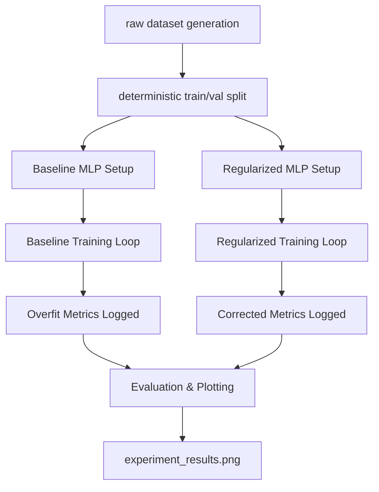

# System Architecture

## Component Flow

## Directory Responsibilities

- `src/overfitlab/data.py`: Handles pure, deterministic data creation and tensor conversion.
- `src/overfitlab/model.py`: Neural network class definitions.
- `src/overfitlab/train.py`: Agnostic training loops that accept models and output tracking dictionaries.
- `src/overfitlab/experiment.py`: The orchestrator joining data, models, and plotting.
